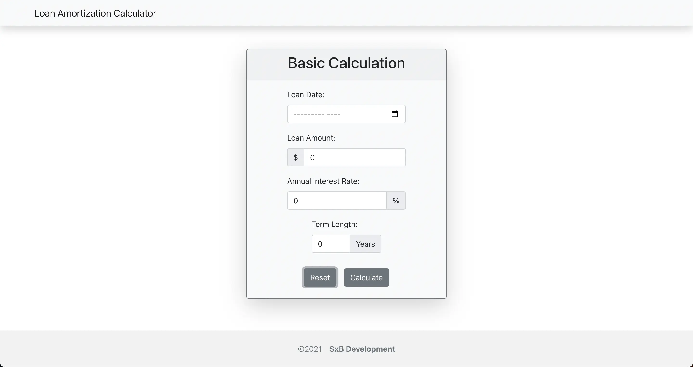
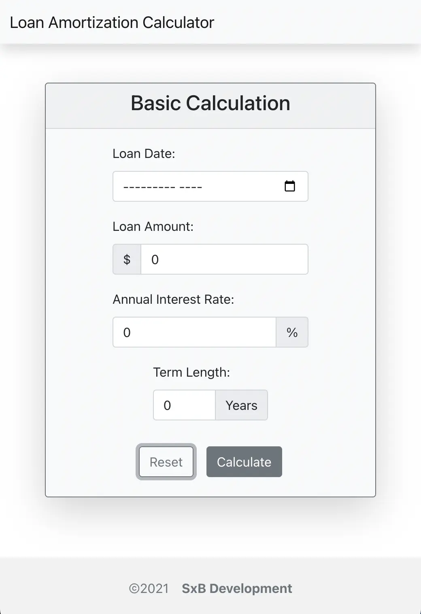
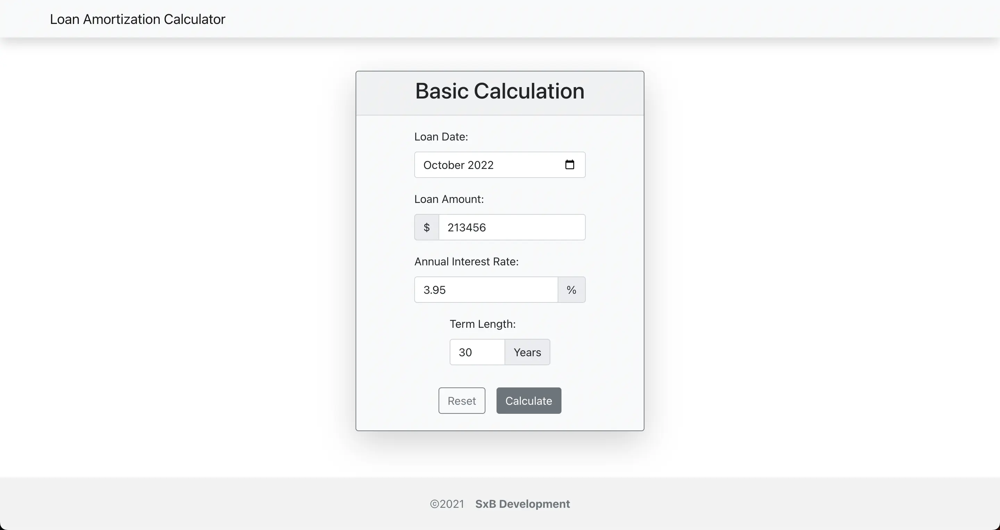
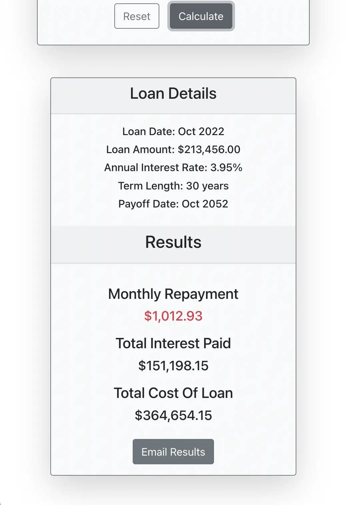
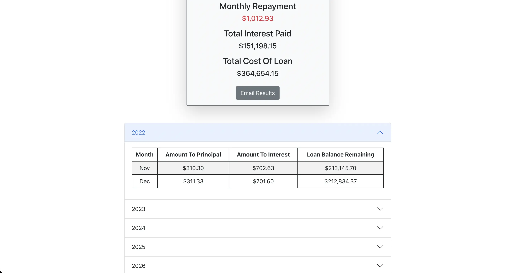
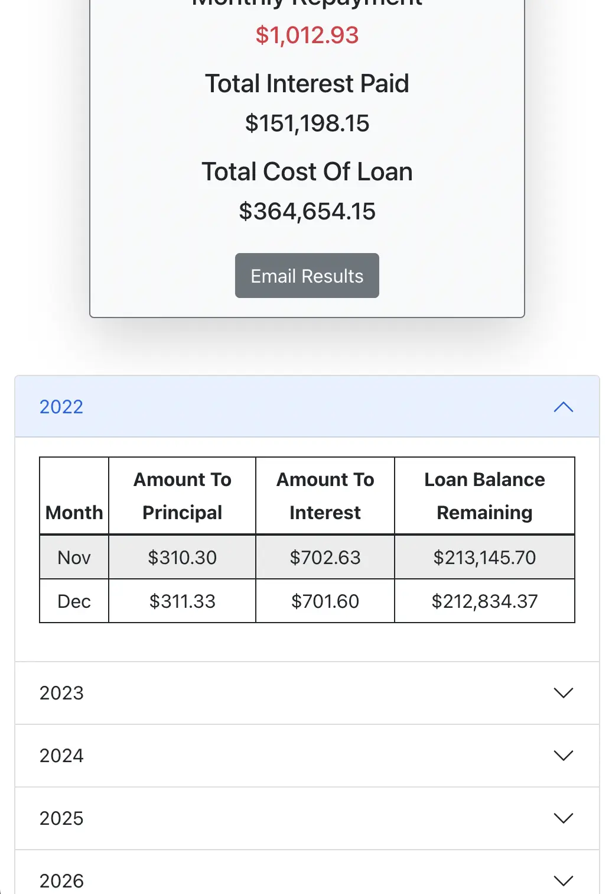
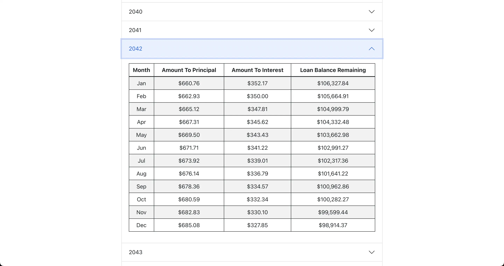
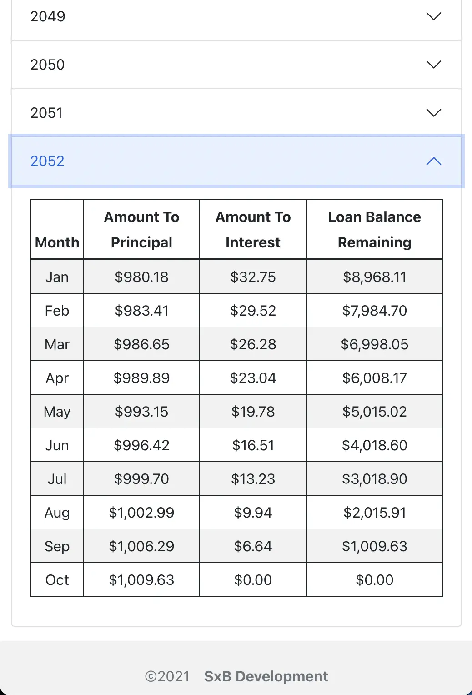

# Loan Amortization Calculator

[view here](http://loan.scottxbrown.com)

A web app that allows users to input some basic loan information and receive a detailed repayment plan.

Built with: `React`, `React Router`, `Bootstrap`, `DayJS`, and `Javascript`.

***

# Project Status

**Users can input their basic loan details and see what the monthly repayment amount will be, the amount of interest paid for lifetime of loan, and the complete cost for lifetime of loan. This is further broken out into a table with monthly rows, that accordion by year.**

This project is polished enough to host on my portfolio, but more features/components could be added (advanced section with down payment info, abillity to add extra payments to pay off loan quicker, etc & a more modern email template with html/images.)

***

# Project Screen Shots

Landing page:

Landing page (MOBILE VIEW):

Filled out loan details:

Loan details component (MOBILE VIEW):

Repayment table component (first year open):

Repayment table component (first year open - MOBILE VIEW):

Repayment table component (middle year open):

Repayment table component (last year open - MOBILE VIEW):

***

# Reflection

I started this project due to an acquaintance mentioning that their company had nothing to get basic loan repayment information while on the road. This sounded like a problem that I was ready to solve with my given skills at the time. As I was really focused on creating a usable solution, I didn't want to spend unneccessary time on CSS. So, I decided to choose `Bootstrap`/`React-Bootstrap` for this web app. This allowed me to focus on the `javascript`, data calculations, and rendering.

Project goals included using technologies learned up until this point, learning more about a CSS framework (bootstrap) and form input validation, and trying to build something that could be used in a browser.

Originally, I wanted to build an input form that users could give the basics of their loan information, and when submitted result in a new component rendering their repayment schedule complete with how much of each payment was going to interest and principal. I started this process by using the `create-react-app` boilerplate, then adding `react-router-6.3`, and `react-bootstrap` for styling.

One of the main challenges I ran into was how to structure the data, so I could then access it the way I needed to display to the user properly. This led me to spending time researching what solutions existed. One that came up was `DayJS` to help with formatting the dates. The rest of the data structure went through a few iterations, but I finally fell on: 

- **repaymentDataByYear array** of objects. These objects have a key of the year, and a value of a singleYearData array.
- **singleYearData array** of singleMonthData objects.
- **singleMonthData objects** contain the amount to interest, amount to principal, remaining balance, and the month.

I also wanted to be able to share the same info/data by sharing the url. I approached this problem by way of `React Router` and it's useSearchParams() hook. With this I was able to make it so if a user shared the complete url after inputting and rendering data, that url could be opened and it would appear complete to the new user that it was shared with.

**At the end of the 4 week period, this web app has all functionality needed to give teh user their repayment schedule for a loan of any amount, interest rate, and length of time. It includes:**
- form inputs, complete with proper validation/restrictions
- calculated monthly repayment, and total cost of loan
- total interest paid for lifetime of loan
- complete cost of loan including interest and principal
- accordion table by year that holds the monthly repayment info
- button to open email client and send results via email
- copy/pastable URL to share same results with another user
- button to easily reset all forms and data displays

**The technologies implemented in this project are:**
- React
- React Router
- Bootstrap
- DayJS
- Javascript/JSX